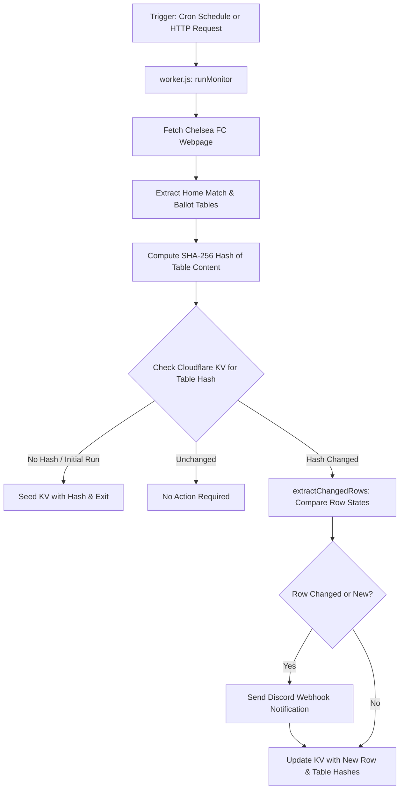

# Chelsea On-Sale Date Bot — System Entry Point & Developer Architecture

Welcome to the **Chelsea On-Sale Date Bot** codebase. This document serves as the primary entry point for developers and AI agents to understand the architecture, data flow, component breakdown, configuration, and operation of this project.

---

## 📌 Executive Summary

The **Chelsea On-Sale Date Bot** is a serverless monitor built for **Cloudflare Workers**. It automatically tracks ticket release schedules, ballot application window dates, and on-sale dates for Chelsea FC men's home matches on the official Chelsea FC website, diffs table data using **Cloudflare KV storage**, and delivers real-time notifications to **Discord** via Webhooks.

---

## 🏗️ Architecture & Data Flow



### Key Workflow Steps
1. **Triggering**: Execution starts via Cloudflare Scheduled Event (Cron) or an incoming HTTP GET request (`fetch`).
2. **Page Scraping**: Fetches `https://www.chelseafc.com/en/all-on-sale-dates-men` with a browser `User-Agent`.
3. **Dual Parsing Strategy**:
   - **Direct DOM Extraction**: Scans the HTML DOM for `<table>` elements and pairs them with preceding `<h2>` fixture titles and `<h5>` competition headings (e.g. `Premier League Home - Chelsea vs Brighton...`).
   - **Fallback JSON Parsing**: If direct tables are not found, parses JSON props embedded in `<div data-component="GenericContentBlock" data-props="...">`.
4. **Filtering**: Excludes away matches (headings containing `"away"`) to monitor home fixtures and ballot application windows.
5. **Table-Level Change Detection**: Computes a SHA-256 checksum for each table. Compares it against `lastHash_<tableHeader>` stored in Cloudflare KV (`MY_KV`).
6. **Row-Level & Ballot Diffing**: Extracts rows containing ballot dates (*Ticket Application Window Open/Close*, *Access Window Open/Close*) or traditional sale dates (*Season Ticket Holders*, *Members*, *General Sale*).
7. **Notification**: Formats changed rows into Markdown alerts and POSTs them to `DISCORD_WEBHOOK_URL` with a user mention `<@DISCORD_USER_ID>`.
8. **State Persist**: Updates KV storage with the latest row state and table checksums.

---

## 📁 Repository Structure & File Map

| Path | Description |
| :--- | :--- |
| [`worker.js`](file:///C:/Users/Peter/projects/chelsea-on-sale-date-bot/chelsea-on-sale-date-bot/worker.js) | Primary entry point script containing Cloudflare Worker event handlers, scraping logic, KV diffing, and Discord webhook integration. |
| [`wrangler.jsonc`](file:///C:/Users/Peter/projects/chelsea-on-sale-date-bot/chelsea-on-sale-date-bot/wrangler.jsonc) | Cloudflare Wrangler configuration file specifying worker name, compatibility date, main module file, and KV bindings. |
| [`README.md`](file:///C:/Users/Peter/projects/chelsea-on-sale-date-bot/chelsea-on-sale-date-bot/README.md) | Deployment and Cloudflare setup manual (Dashboard steps, environment variables, cron configuration). |
| [`example/`](file:///C:/Users/Peter/projects/chelsea-on-sale-date-bot/chelsea-on-sale-date-bot/example/) | Directory containing reference HTML snapshots of the Chelsea FC ticketing site for test fixture inspection. |

---

## 🧩 Core Component & Function Breakdown

All core logic resides in [`worker.js`](file:///C:/Users/Peter/projects/chelsea-on-sale-date-bot/chelsea-on-sale-date-bot/worker.js):

### 1. Handler Layer
- **`scheduled(event, env, ctx)`** ([`worker.js:L2`](file:///C:/Users/Peter/projects/chelsea-on-sale-date-bot/chelsea-on-sale-date-bot/worker.js#L2)): Cron handler called on scheduled intervals.
- **`fetch(request, env)`** ([`worker.js:L5`](file:///C:/Users/Peter/projects/chelsea-on-sale-date-bot/chelsea-on-sale-date-bot/worker.js#L5)): Manual trigger endpoint returning HTTP status confirmation.

### 2. Scraping & Parsing Engine
- **`fetchPage(url)`** ([`worker.js:L64`](file:///C:/Users/Peter/projects/chelsea-on-sale-date-bot/chelsea-on-sale-date-bot/worker.js#L64)): Performs HTTP GET request with customized headers.
- **`extractAllTables(htmlContent)`** ([`worker.js:L69`](file:///C:/Users/Peter/projects/chelsea-on-sale-date-bot/chelsea-on-sale-date-bot/worker.js#L69)): Dual-strategy parser extracting rendered HTML tables or fallback JSON `data-props`.
- **`parseTableRows(tableHtml)`** ([`worker.js:L177`](file:///C:/Users/Peter/projects/chelsea-on-sale-date-bot/chelsea-on-sale-date-bot/worker.js#L177)): Converts raw `<th>` and `<td>` HTML blocks into clean arrays, stripping inner HTML tags.

### 3. Diffing & Normalization Engine
- **`computeHash(text)`** ([`worker.js:L270`](file:///C:/Users/Peter/projects/chelsea-on-sale-date-bot/chelsea-on-sale-date-bot/worker.js#L270)): Uses Web Crypto API (`crypto.subtle.digest`) to generate SHA-256 table hashes.
- **`getOpponentName(headers, data, tableHeader)`** ([`worker.js:L204`](file:///C:/Users/Peter/projects/chelsea-on-sale-date-bot/chelsea-on-sale-date-bot/worker.js#L204)): Extracts opponent name from headers or fixture title (`Chelsea vs <Opponent>`).
- **`buildRowKey(...)`** ([`worker.js:L218`](file:///C:/Users/Peter/projects/chelsea-on-sale-date-bot/chelsea-on-sale-date-bot/worker.js#L218)): Generates deterministic slug keys for each match row based on date, opponent, and competition.
- **`extractChangedRows(tableHtml, tableHeader, env)`** ([`worker.js:L150`](file:///C:/Users/Peter/projects/chelsea-on-sale-date-bot/chelsea-on-sale-date-bot/worker.js#L150)): Compares current row JSON against stored KV row state to pinpoint exact ballot date updates.

### 4. Notification Engine
- **`sendDiscordNotification(webhookUrl, pageUrl, formattedMessage, env)`** ([`worker.js:L278`](file:///C:/Users/Peter/projects/chelsea-on-sale-date-bot/chelsea-on-sale-date-bot/worker.js#L278)): Sends POST request to Discord Webhook with formatted text and Discord user tag (`<@USER_ID>`).

---

## ⚙️ Configuration & Environment Bindings

Configured in [`wrangler.jsonc`](file:///C:/Users/Peter/projects/chelsea-on-sale-date-bot/chelsea-on-sale-date-bot/wrangler.jsonc) and Cloudflare Worker Environment Variables:

| Secret / Variable | Type | Description |
| :--- | :--- | :--- |
| `MY_KV` | KV Namespace Binding | Cloudflare KV namespace instance for storing table hashes (`lastHash_*`) and row state (`row_*`). |
| `DISCORD_WEBHOOK_URL` | Environment Secret | Full Discord Webhook URL for posting ticket alerts. |
| `DISCORD_USER_ID` | Environment Secret | Discord User ID to ping in the notification message. |

---

## 🚀 Operations & Development Guide

### Local Development & Testing
```bash
# Test worker locally using Wrangler
npx wrangler dev

# Trigger manual fetch handler
curl http://localhost:8787
```

### Deployment
```bash
# Deploy to Cloudflare Workers
npx wrangler deploy
```

Refer to [`README.md`](file:///C:/Users/Peter/projects/chelsea-on-sale-date-bot/chelsea-on-sale-date-bot/README.md) for step-by-step setup instructions in the Cloudflare Dashboard.
